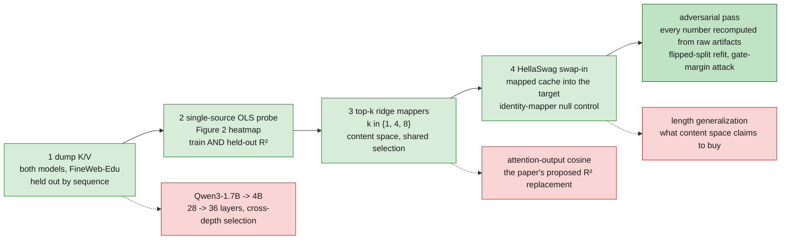
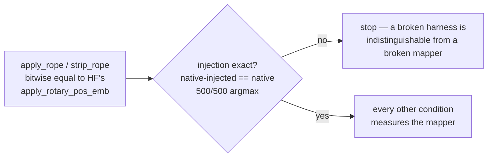
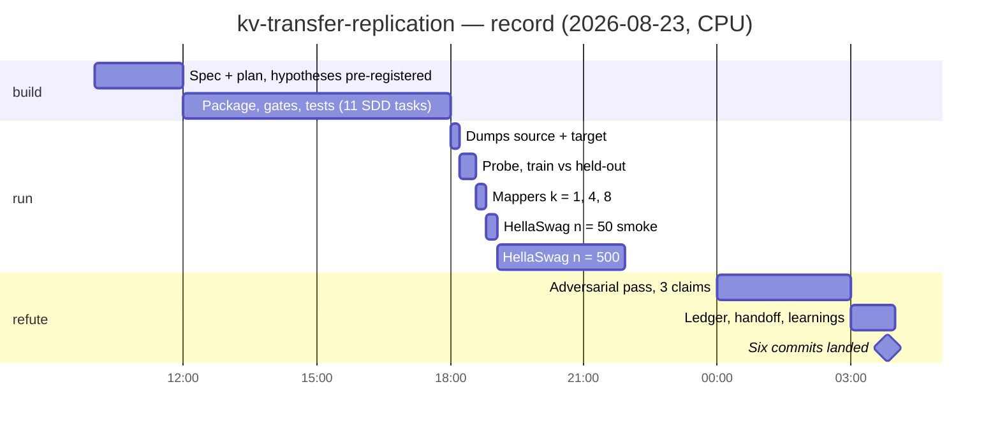
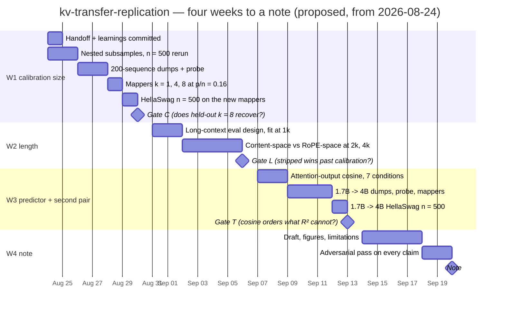

# kv-transfer-replication

CPU-scale replication of *Cross-Model KV Cache Transfer in LLM Families* (Heo et al.,
NVIDIA, [arXiv 2608.03893](https://arxiv.org/abs/2608.03893), 4 Aug 2026) on the
matched-KV pair Qwen3-0.6B -> Qwen3-1.7B. The paper released no code; everything here is
reconstructed from its equations. The claim under test, stated once:

> A linear map fitted in RoPE-stripped content space carries a small model's KV cache into a
> larger sibling well enough that the sibling keeps most of its accuracy — and the
> reconstruction score the paper reports for that map, in-sample R², is a safe guide to
> which map to use only well away from the interpolation regime p/n -> 1. A small-scale
> replication that reports in-sample R² picks the worst mapper while looking the most
> successful.

The second half is the replication's own finding, not the paper's, and it does not refute
the paper: the paper calibrates at a token count where the effect is small. What this repo
establishes is that calibration size is load-bearing and the paper's in-sample-only
reporting makes that invisible.

Vocabulary: "calibration" is the FineWeb-Edu token set the mapper is fitted on;
"held-out" always means held out **by sequence**, never by token; "retention" is reported
both raw and floor-normalized against the 25% chance floor. Nothing here is described as
certified or verified — results carry `[VALIDATED]` (ran, and survived an independent
attempt to refute it), `[BASELINE]` (ran; numbers in the ledger), `[STRETCH]` (designed,
not run), `[FUTURE]` (not designed), or `[SUPERSEDED]`.

## Setup

```bash
uv venv --python 3.12 .venv
uv pip install torch --index-url https://download.pytorch.org/whl/cpu
uv pip install -e ".[dev]"
pytest
```

The suite runs offline in a few seconds against tiny randomly-initialised Qwen3 models;
only the real runs below touch real weights. A green suite is not a green replication —
it proves the harness, not the result.

## What it does

Four replication steps, each a script over the previous step's artifacts, guarded by two
correctness gates that make everything downstream interpretable.



| step | what | status |
|---|---|---|
| 1 | K/V dumps for both models on 50 FineWeb-Edu sequences, stride-subsampled, split by sequence | `[BASELINE]` ran |
| 2 | single-source OLS probe over every (source layer, target layer) cell, scored on train **and** held-out tokens | `[BASELINE]` ran; the paper reports train only |
| 3 | top-k cross-layer ridge mappers at k = 1, 4, 8, selection shared across heads and across K/V | `[BASELINE]` ran; Appendix D parameter counts reproduced exactly |
| 4 | mapped cache injected into the target, HellaSwag at n = 500, seven conditions including two null controls | `[BASELINE]` ran; n = 50 smoke `[SUPERSEDED]` |
| — | adversarial verification of the three load-bearing claims | `[VALIDATED]` 3/3 survived |
| — | attention-output cosine | `[STRETCH]` brief written, not run |
| — | length generalization | `[FUTURE]` not designed — every evaluation here is short-context |
| — | Qwen3-1.7B -> 4B pair | `[STRETCH]` in the registry, not run |

The two gates, both pinned by tests and both re-checked on real weights in every
evaluation run:



Two protocol choices the paper leaves open and this repo had to make: the target sees only
the final context token and receives all earlier context as mapped cache (the minimal
faithful reading of "the full prompt is prefilled by the source"); and the split is by
sequence, because adjacent tokens are correlated and a token split would leak into exactly
the held-out number this repo exists to measure.

```bash
python scripts/prepare_tokens.py    --pair qwen3-0.6b-to-1.7b --n-seqs 50
python scripts/dump_kv.py           --pair qwen3-0.6b-to-1.7b --which source
python scripts/dump_kv.py           --pair qwen3-0.6b-to-1.7b --which target
python scripts/probe.py             --pair qwen3-0.6b-to-1.7b
python scripts/plot_probe.py        --pair qwen3-0.6b-to-1.7b
python scripts/fit_mapper.py        --pair qwen3-0.6b-to-1.7b --k 1 4 8
python scripts/eval_hellaswag.py    --pair qwen3-0.6b-to-1.7b --n 500
python scripts/summarize_hellaswag.py --pair qwen3-0.6b-to-1.7b --expect-n 500
```

The summarizer fails closed: a condition with zero records, a mismatched or duplicated
example set, or a count short of `--expect-n` is a refusal, not a NaN row. It fired on a
real case during the first run. Numbers live in [`docs/ledger.md`](docs/ledger.md), not
here; every one of them is recomputed from `results/` by a summarize script.

## Layout

```
kvt/             pairs, rope, cache, data, ridge, mapper, hellaswag — the package
scripts/         one script per step; summarize_hellaswag.py is the fail-closed gate
tests/           offline suite over tiny models; the two gates live here
results/         committed summaries + figure; per-example JSONL and .npy regenerable
docs/ledger.md   pre-registered hypotheses, protocol decisions, what ran, verdicts, what is blocked
docs/learnings/  one dated fact per file, each with a captured basis and a re-verify line
docs/handoff/    read-this-first brief for the next session; entries immutable
```

`data/` and `mappers/` are gitignored (about 6 GB) and regenerate in roughly half an hour.

## Timeline

Two parts, kept apart on purpose: the **record** is what the ledger and `git log` say
happened; the **proposal** is a plan and nothing in it has run.

### Record

Built and run in one session, 2026-08-23 to 2026-08-24 UTC, on a CPU-only 32 GB machine.
Built task-by-task under subagent-driven development — implementer, independent review,
fix, re-review per task — with mutation tests on the gates. Wall-clocks are from the ledger.



Clock positions are approximate; the run durations are measured. Three things fired along
the way and are recorded rather than dropped: one pre-registered prediction was refuted
(stripping RoPE did not improve short-context fit — the prediction was the replicator's,
not the paper's); a "below chance" claim from the n = 50 smoke was withdrawn at n = 500,
and the withdrawal itself was then qualified when the skeptic found the two runs share only
9 of 50 examples; and a k = 1 self-mapper gate was found blind to feature ordering by a
mutation test and replaced with a k = 3 gate.

### Proposal: four weeks to a note

This is a **proposal**, not a record. It starts from where the repository stands on
2026-08-24 — all four steps run, three claims survived refutation, `docs/handoff/` and
`docs/learnings/` still untracked — and targets a short written note in four weeks. Each
week ends at a gate. A stop condition firing is a result the note reports, not a reason
the plan fails: it changes the note's shape, not whether there is one.



| week | deliverable | gate at the end of the week |
|---|---|---|
| 1 | Untracked docs committed. n = 500 rerun with **nested** subsamples (draw the largest set once, take prefixes) so smoke and full runs become comparable. 200-sequence calibration: dumps, probe, mappers, HellaSwag — moves k = 8 from p/n = 0.80 to 0.16. | **C**: does held-out K R² at k = 8 recover, and does HellaSwag accuracy follow it? If k = 8 recovers, the collapse was calibration size and the note says so. If it does not, cross-layer selection costs accuracy on this pair even outside interpolation — a different note, not a failed one. |
| 2 | The gap the current results cannot speak to. Fit at 1k context, evaluate content-space against RoPE-space mappers at 2k and 4k on a long-context task — HellaSwag contexts are too short to test this. | **L**: does the stripped-RoPE mapper beat the un-stripped one past the calibration length? This is the property content space actually claims to buy; H1b's refutation says nothing about it either way. |
| 3 | Attention-output cosine over the seven existing conditions (brief already written). Second pair, Qwen3-1.7B -> 4B, 28 -> 36 layers, which exercises cross-depth selection the 28 -> 28 pair cannot. | **T**: with one pair there is no correlation to compute; the question is whether cosine orders the conditions the way accuracy does while in-sample R² orders them backwards. |
| 4 | Draft. Figures: heatmap train vs held-out; in-sample vs held-out R² vs accuracy across k, at both calibration sizes. Limitations carry the CPU-only scope, the ±4 pp interval at n = 500, and the untested paper claims (prefill latency, MLP mapper, other benchmarks). | Every empirical number in the draft recomputes from `results/`; each load-bearing claim handed to a skeptic to refute; survivors stay. |

What the plan assumes and does not control: a CPU-only box, so every n = 500 evaluation
is about three hours and the 4B model roughly triples that; a GPU would compress W1–W3
to days. HellaSwag at n = 500 resolves retain-vs-collapse, not differences under about
4 pp — gates are written against endpoints, never neighbours. If either compute assumption
slips, the gates stay where they are and the weeks slide.
